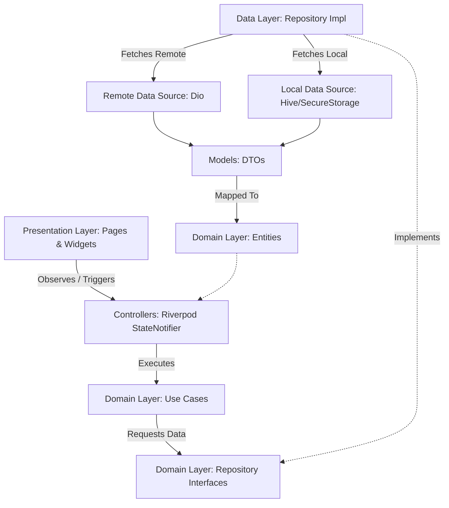
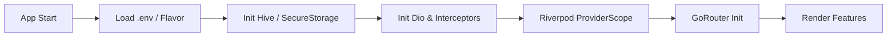
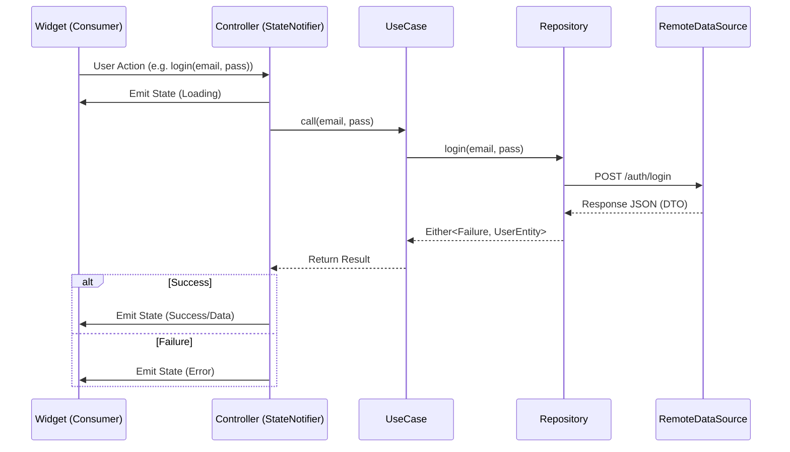

# MILLIY METR - Enterprise Flutter Architecture

> **Tagline:** Yuqori Sifat
> **Type:** Multi-Vendor Construction Materials Marketplace
> **Target:** Production-Grade Enterprise Application

This document outlines the complete architectural foundation for Milliy Metr, adhering to Google standards, Clean Architecture, and SOLID principles.

---

## 1. Complete Folder Structure

The project uses a **Feature-First Clean Architecture**. This ensures maximum scalability and allows teams to work on independent features without conflicts.

```text
lib/
├── core/                             # App-wide shared core utilities
│   ├── config/                       # Environment, Flavors (.env loaders)
│   ├── constants/                    # App constants, API endpoints
│   ├── di/                           # Dependency Injection (Riverpod Providers)
│   ├── errors/                       # Custom exceptions, Failures (fpdart/dartz)
│   ├── network/                      # Dio config, Interceptors, Connection Check
│   ├── storage/                      # Hive wrappers, Secure Storage
│   ├── theme/                        # Design System, Colors, Typography
│   └── utils/                        # Extensions, Formatters, Validators
│
├── features/                         # Feature Modules
│   ├── authentication/
│   │   ├── data/
│   │   │   ├── data_sources/         # Remote/Local sources (AuthRemoteDataSource)
│   │   │   ├── models/               # DTOs (Data Transfer Objects)
│   │   │   └── repositories/         # Repository Implementations
│   │   ├── domain/
│   │   │   ├── entities/             # Core Business Entities (UserEntity)
│   │   │   ├── repositories/         # Repository Interfaces
│   │   │   └── use_cases/            # Business logic (LoginUseCase)
│   │   └── presentation/
│   │       ├── controllers/          # Riverpod StateNotifiers / AsyncNotifier
│   │       ├── pages/                # UI Screens
│   │       └── widgets/              # Feature-specific widgets
│   │
│   ├── catalog/                      # (Same structure as auth)
│   ├── checkout/                     # (Same structure as auth)
│   └── ... (Other modules)
│
├── router/                           # Navigation
│   ├── app_router.dart               # GoRouter configuration
│   ├── route_names.dart              # Strongly typed route paths
│   └── guards/                       # AuthGuard, RoleGuard
│
├── shared/                           # Reusable App-Wide UI Components
│   ├── widgets/                      # Buttons, TextFields, Cards
│   ├── dialogs/                      # BottomSheets, Alerts
│   └── layouts/                      # Responsive scaffold wrappers
│
├── l10n/                             # Localization (ARB files - uz, en, ru)
└── main.dart                         # Entry point (ProviderScope, Env Init)
```

---

## 2. Architecture Diagram



---

## 3. Dependency Flow



---

## 4. Data Flow (Unidirectional)



---

## 5. Feature Structure (Empty Scalable Modules)

Required modules to be created under `lib/features/`:
- `splash/`
- `onboarding/`
- `authentication/` (Login, Register, OTP, Password Reset)
- `home/` (Dashboard, Banners, Quick Links)
- `catalog/` (Products list, Filters, Sorting)
- `categories/` (Hierarchical categories)
- `product_details/` (Images, Specs, Pricing, Reviews)
- `search/` (Debounced search, Recent, Suggestions)
- `favorites/` (Wishlist)
- `cart/` (Local & Remote sync)
- `checkout/` (Addresses, Shipping, Payment selection)
- `orders/` (Order history)
- `order_details/`
- `delivery_tracking/` (Status timeline, Courier details)
- `notifications/` (Push & In-app)
- `chat/` (Buyer-Seller communication)
- `seller_profile/` (Public store view)
- `user_profile/` (Account management)
- `settings/` (Language, Theme, Security)
- `reviews/` (Ratings & Text reviews)
- `coupons/` (Promo codes)
- `payments/` (Cards, Transaction history)
- `help_center/` (FAQ)
- `support/` (Tickets)

---

## 6. Module Responsibilities

- **Presentation**: ONLY handles UI, animations, and dispatching events to Controllers. NO business logic.
- **Domain**: Pure Dart. Contains business rules (Use Cases), Entities, and Repository Contracts. Does not know about Flutter or APIs.
- **Data**: Implements Repository Contracts. Handles network calls, local caching, and mapping DTOs to Entities.
- **Core**: Shared infrastructure (Network, Storage, Design System).

---

## 7. pubspec.yaml Dependencies

```yaml
dependencies:
  flutter:
    sdk: flutter
  
  # State Management & DI
  flutter_riverpod: ^2.5.1      # Immutable state, DI, caching
  riverpod_annotation: ^2.3.5   # Code generation for Riverpod

  # Navigation
  go_router: ^13.2.0            # Declarative deep-link ready routing
  
  # Network
  dio: ^5.4.2                   # Advanced HTTP client (Interceptors, Retry)
  
  # Functional Programming (Error Handling)
  fpdart: ^1.1.0                # Either<L,R> for pure error handling
  
  # Serialization
  freezed_annotation: ^2.4.1    # Immutable data classes / Unions
  json_annotation: ^4.8.1

  # Local Storage
  hive: ^2.2.3                  # Fast NoSQL caching
  hive_flutter: ^1.1.0
  flutter_secure_storage: ^9.0.0 # Encrypted tokens

  # Environment & Localization
  flutter_dotenv: ^5.1.0        # .env file support
  flutter_localizations:
    sdk: flutter
  intl: ^0.19.0                 # Date/Currency formatting

  # UI / UX
  cached_network_image: ^3.3.1  # Offline image caching
  shimmer: ^3.0.0               # Skeleton loaders
  responsive_builder: ^0.7.0    # Tablet/Foldable breakpoints

dev_dependencies:
  build_runner: ^2.4.9          # Code generator runner
  freezed: ^2.4.7
  json_serializable: ^8.0.0
  riverpod_generator: ^2.4.0
  flutter_lints: ^3.0.1         # Strict linting
  custom_lint: ^0.6.2           # Advanced Riverpod lints
```

---

## 8. analysis_options.yaml (Strict Lints)

```yaml
include: package:flutter_lints/flutter.yaml

analyzer:
  exclude:
    - "**/*.g.dart"
    - "**/*.freezed.dart"
  errors:
    missing_required_param: error
    missing_return: error
    parameter_assignments: warning
  language:
    strict-casts: true
    strict-inference: true
    strict-raw-types: true

linter:
  rules:
    - prefer_const_constructors
    - prefer_const_declarations
    - prefer_final_locals
    - prefer_final_fields
    - avoid_print
    - avoid_empty_else
    - cancel_subscriptions
    - close_sinks
    - always_declare_return_types
    - require_trailing_commas
    - sort_child_properties_last
    - unawaited_futures
    - use_build_context_synchronously
```

---

## 9. Environment Structure

Using `flutter_dotenv` for configuration separation.
Environments:
- `.env.dev` (Development)
- `.env.stg` (Staging)
- `.env.prod` (Production)

Variables:
```dotenv
BASE_URL=https://api.milliy-metr.uz/v1
SOCKET_URL=wss://ws.milliy-metr.uz
ENV=PRODUCTION
TIMEOUT_MS=15000
SENTRY_DSN=...
```
Loaded in `main.dart` based on `--dart-define=FLAVOR=prod`.

---

## 10. Design System Structure

Architecture for scalable styling:
- **`AppColors`**: Semantic colors (primary, success, warning, surface). NO hardcoded colors in widgets.
- **`AppTypography`**: Inter or Roboto, semantic text styles (h1, h2, bodyLarge, labelSmall).
- **`AppSpacing`**: `sm (8)`, `md (16)`, `lg (24)`, `xl (32)`.
- **`ThemeExtension`**: Custom theme properties for Dark/Light mode switching.
- **`Material 3`**: `useMaterial3: true` with a custom `ColorScheme`.

---

## 11. Repository Architecture

Repositories act as the single source of truth.
```dart
abstract class ProductRepository {
  Future<Either<Failure, List<ProductEntity>>> getProducts({required int page});
}

class ProductRepositoryImpl implements ProductRepository {
  final ProductRemoteDataSource remoteDataSource;
  final ProductLocalDataSource localDataSource;
  final NetworkInfo networkInfo;

  // Logic: Check network -> Fetch Remote -> Cache Local -> Return Entity
  // If Offline -> Fetch Local -> Return Entity
}
```

---

## 12. API Layer Structure

- **Dio Instance**: Configured as a Singleton via Riverpod.
- **AuthenticationInterceptor**: Injects Bearer tokens automatically.
- **LoggingInterceptor**: Logs requests/responses in Dev only.
- **TokenRefreshInterceptor**: Catches 401, queues requests, refreshes token, retries queued requests.
- **ErrorMapper**: Catches DioExceptions and converts them to standardized `ServerFailure`, `NetworkFailure`, etc.

---

## 13. Navigation Structure

- **GoRouter**: Used for imperative and declarative routing.
- **Nested Navigation**: `StatefulShellRoute` for Bottom Navigation Bar (Home, Catalog, Cart, Profile) to maintain state per tab.
- **Deep Linking**: Route paths defined for future sharing (e.g., `/product/:id`).
- **Guards**: 
  - `AuthGuard`: Redirects to `/login` if token is missing.
  - `RoleGuard`: Prevents Sellers from accessing Admin routes.

---

## 14. State Management Structure

- **Riverpod (`@riverpod`)**:
  - `FutureProvider` for one-time fetch operations (e.g., getting a product detail).
  - `AsyncNotifierProvider` for complex state with mutations (e.g., Cart management).
  - **State Pattern**: UI reacts to `.when(data: (data) => ..., loading: () => ..., error: (err, stack) => ...)`
  - Providers are grouped by feature in `features/FEATURE/presentation/controllers/`.

---

## 15. Local Storage Structure

- **Hive**: Used for caching catalog data, search history, and cart items for offline resilience.
- **Flutter Secure Storage**: ONLY used for sensitive data (JWT Access Token, Refresh Token, User Session data).
- **Caching Layer Strategy**: Repositories check `Hive` if offline, update `Hive` when online request succeeds.

---

## 16. RBAC Architecture (Role-Based Access Control)

Roles: `SUPER_ADMIN`, `ADMIN`, `MODERATOR`, `SELLER`, `CUSTOMER`.
- **Auth State**: The Riverpod AuthController holds the `UserEntity`, which contains `List<Role>`.
- **UI Rendering**: `RoleWidget(allowedRoles: [Role.seller], child: SellerDashboardCard())`.
- **Routing**: `redirect` logic in GoRouter checks `AuthNotifier.role`.

---

## 17. Admin Panel Architecture

The Admin Panel should ideally be a **Flutter Web** target sharing the same `core` and `domain` packages if structured as a Monorepo (Melos), OR a separate root in the same codebase.
- **Features**: Dashboard, Approvals, User Management, Banners.
- **UI Strategy**: Uses `NavigationRail` or Web Sidebars instead of BottomNavigationBar.
- **Data Grids**: Utilize `syncfusion_flutter_datagrid` or similar for complex reporting tables.

---

## 18. Seller Panel Architecture

Built into the mobile app (and Web) but hidden behind RBAC.
- **Seller Dashboard**: Real-time sales metrics.
- **Inventory Management**: Forms for adding products (Cement, Steel), images, specs, stock quantity.
- **Order Management**: Accept/Reject/Ship statuses.
- **Architecture**: Segregated Riverpod providers (`SellerOrdersNotifier`, `SellerProductsNotifier`) that only fetch seller-specific endpoints.

---

## 19. Future Scalability Strategy

- **Payments**: Isolate payment logic into a generic `PaymentStrategy` interface. Implementing Click, Payme, Uzum will just be adding strategy classes.
- **Warehouse/Maps**: Keep Google Maps / Yandex Maps implementation behind an abstract `MapService` to easily swap providers.
- **Realtime / Chat**: Architecture supports injecting WebSockets into Repositories and exposing them via Riverpod `StreamProvider`.
- **Push Notifications**: Firebase Messaging wrapper injected at App Start, dispatching deep links to GoRouter.

---

## 20. Enterprise Best Practices

- **SOLID**: Each class has one responsibility (e.g., Mappers map, Sources fetch).
- **DRY (Don't Repeat Yourself)**: Shared UI widgets and theme extensions.
- **KISS (Keep It Simple, Stupid)**: Don't over-engineer simple screens, but strictly follow architecture for complex flows.
- **Testing**: Architecture allows 100% testability. Use cases can be mocked, Repositories can be unit tested without UI, UI can be tested with Mock providers.
- **Barrel Exports**: Use `index.dart` in directories to clean up imports.
- **Localization**: Hardcoded strings are strictly forbidden. Use `AppLocalizations.of(context)`.

---
*End of Architectural Foundation Document for Milliy Metr.*
