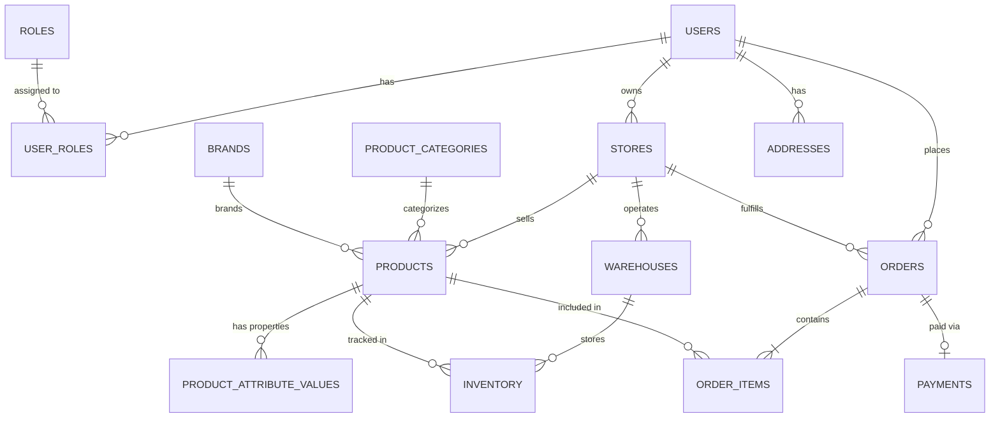

# MILLIY METR - Enterprise Backend & Database Architecture

> **Tagline:** Yuqori Sifat
> **Type:** Multi-Vendor Construction Materials Marketplace
> **Target:** Production-Grade Enterprise Backend

This document outlines the complete backend architecture, REST API design, and Database Schema for Milliy Metr.

---

## 1. Complete Database Design (Relational - PostgreSQL)

All tables use `UUID` or `BIGSERIAL` for primary keys. They all include `created_at`, `updated_at`, and `deleted_at` (for soft deletes).
Indexes are defined for foreign keys and frequently searched columns.

### Access Control
- **`roles`**: `id` (PK), `name` (uq), `description`, `created_at`, `updated_at`, `deleted_at`
- **`permissions`**: `id` (PK), `name` (uq), `module`, `created_at`, `updated_at`, `deleted_at`
- **`role_permissions`**: `role_id` (FK, idx), `permission_id` (FK, idx)
- **`users`**: `id` (PK), `email` (uq, idx), `phone` (uq, idx), `password_hash`, `first_name`, `last_name`, `status`, `created_at`, `updated_at`, `deleted_at`
- **`user_roles`**: `user_id` (FK, idx), `role_id` (FK, idx)

### Seller & Store Management
- **`stores`**: `id` (PK), `owner_id` (FK users, idx), `name`, `slug` (uq, idx), `description`, `logo_url`, `status` (PENDING, ACTIVE, SUSPENDED), `created_at`, `updated_at`, `deleted_at`
- **`seller_verifications`**: `id` (PK), `store_id` (FK, idx), `document_type`, `document_url`, `tax_id`, `status` (PENDING, APPROVED, REJECTED), `verified_by` (FK users), `created_at`, `updated_at`, `deleted_at`

### Product Catalog (Construction Specific)
- **`product_categories`**: `id` (PK), `parent_id` (FK self, idx), `name`, `slug` (uq, idx), `icon`, `is_active`, `created_at`, `updated_at`, `deleted_at`
- **`brands`**: `id` (PK), `name`, `slug` (uq, idx), `logo_url`, `created_at`, `updated_at`, `deleted_at`
- **`units`**: `id` (PK), `name` (e.g., kg, ton, meter, sq_meter, piece), `short_name`, `created_at`, `updated_at`, `deleted_at`
- **`products`**: `id` (PK), `store_id` (FK, idx), `category_id` (FK, idx), `brand_id` (FK, idx), `unit_id` (FK), `name`, `slug` (uq, idx), `description`, `base_price`, `status` (DRAFT, PENDING_APPROVAL, ACTIVE, REJECTED), `created_at`, `updated_at`, `deleted_at`. (Indexes on `store_id`, `category_id`, `status`).
- **`product_attributes`**: `id` (PK), `category_id` (FK), `name` (e.g., Grade, Thickness, Color), `type` (TEXT, NUMBER, BOOLEAN), `created_at`, `updated_at`, `deleted_at`
- **`product_attribute_values`**: `id` (PK), `product_id` (FK, idx), `attribute_id` (FK, idx), `value`, `created_at`, `updated_at`, `deleted_at`

### Inventory & Warehousing
- **`warehouses`**: `id` (PK), `store_id` (FK, idx), `name`, `address_id` (FK), `status`, `created_at`, `updated_at`, `deleted_at`
- **`inventory`**: `id` (PK), `product_id` (FK, idx), `warehouse_id` (FK, idx), `quantity`, `reserved_quantity`, `created_at`, `updated_at`, `deleted_at`
- **`inventory_history`**: `id` (PK), `inventory_id` (FK, idx), `change_type` (ADD, SUBTRACT, SET), `quantity_changed`, `reason`, `created_at`, `updated_at`, `deleted_at`

### Ordering System
- **`orders`**: `id` (PK), `customer_id` (FK users, idx), `store_id` (FK stores, idx), `status` (PENDING, CONFIRMED, SHIPPED, DELIVERED, CANCELLED), `total_amount`, `discount_amount`, `delivery_fee`, `final_amount`, `shipping_address_id` (FK), `created_at`, `updated_at`, `deleted_at`. (Index on `customer_id`, `store_id`, `status`).
- **`order_items`**: `id` (PK), `order_id` (FK, idx), `product_id` (FK, idx), `quantity`, `unit_price`, `subtotal`, `created_at`, `updated_at`, `deleted_at`
- **`coupons`**: `id` (PK), `store_id` (FK, nullable), `code` (uq, idx), `discount_type` (PERCENTAGE, FIXED), `discount_value`, `min_order_value`, `start_date`, `end_date`, `usage_limit`, `created_at`, `updated_at`, `deleted_at`

### Payments & Transactions
- **`payments`**: `id` (PK), `order_id` (FK, idx), `provider` (CLICK, PAYME, UZUM, STRIPE, CASH), `amount`, `currency`, `status` (PENDING, COMPLETED, FAILED, REFUNDED), `created_at`, `updated_at`, `deleted_at`
- **`transactions`**: `id` (PK), `payment_id` (FK, idx), `provider_transaction_id` (idx), `payload` (JSONB), `created_at`, `updated_at`, `deleted_at`

### User Interactions
- **`reviews`**: `id` (PK), `product_id` (FK, idx), `customer_id` (FK users, idx), `order_id` (FK), `rating` (1-5), `comment`, `status` (PENDING, APPROVED, REJECTED), `created_at`, `updated_at`, `deleted_at`
- **`wishlist`**: `id` (PK), `customer_id` (FK, idx), `product_id` (FK, idx), `created_at`, `updated_at`, `deleted_at`
- **`cart`**: `id` (PK), `customer_id` (FK, idx), `created_at`, `updated_at`, `deleted_at`
- **`cart_items`**: `id` (PK), `cart_id` (FK, idx), `product_id` (FK, idx), `quantity`, `created_at`, `updated_at`, `deleted_at`

### Location & Delivery
- **`regions`**: `id` (PK), `name`, `created_at`, `updated_at`, `deleted_at`
- **`districts`**: `id` (PK), `region_id` (FK, idx), `name`, `created_at`, `updated_at`, `deleted_at`
- **`addresses`**: `id` (PK), `user_id` (FK, idx), `region_id` (FK), `district_id` (FK), `address_line`, `latitude`, `longitude`, `is_default`, `created_at`, `updated_at`, `deleted_at`
- **`delivery_zones`**: `id` (PK), `store_id` (FK, idx), `region_id` (FK), `district_id` (FK), `created_at`, `updated_at`, `deleted_at`
- **`delivery_fees`**: `id` (PK), `delivery_zone_id` (FK), `base_fee`, `fee_per_kg`, `fee_per_km`, `created_at`, `updated_at`, `deleted_at`

### Communication & Operations
- **`chats`**: `id` (PK), `order_id` (FK, nullable), `customer_id` (FK, idx), `store_id` (FK, idx), `created_at`, `updated_at`, `deleted_at`
- **`messages`**: `id` (PK), `chat_id` (FK, idx), `sender_id` (FK, idx), `content`, `is_read`, `created_at`, `updated_at`, `deleted_at`
- **`notifications`**: `id` (PK), `user_id` (FK, idx), `title`, `message`, `type`, `is_read`, `data` (JSONB), `created_at`, `updated_at`, `deleted_at`
- **`complaints`**: `id` (PK), `user_id` (FK, idx), `target_type` (STORE, PRODUCT, ORDER), `target_id`, `reason`, `status`, `created_at`, `updated_at`, `deleted_at`
- **`audit_logs`**: `id` (PK), `user_id` (FK, idx), `action`, `entity_type`, `entity_id`, `old_values` (JSONB), `new_values` (JSONB), `ip_address`, `created_at`, `updated_at`, `deleted_at`
- **`settings`**: `key` (PK), `value` (JSONB), `description`, `created_at`, `updated_at`, `deleted_at`

---

## 2. ER Diagram (Core Domain)



---

## 3. Backend Folder Structure

Using **Domain-Driven Design (DDD)** and Clean Architecture.

```text
src/
├── config/              # Environment, DB config, Redis config
├── core/                # Shared utilities, Exceptions, Middleware, Guards
├── modules/             # Domain Modules
│   ├── auth/            # Auth Controller, Service, JWT Strategy
│   ├── users/           # User Mgmt, RBAC, Profile
│   ├── stores/          # Store Creation, Verification, Seller Dashboard
│   ├── catalog/         # Products, Categories, Brands, Attributes
│   ├── inventory/       # Warehouses, Stock levels, History
│   ├── orders/          # Cart, Checkout, Order Mgmt, Status Tracking
│   ├── payments/        # Integrations (Click, Payme, Stripe)
│   ├── communications/  # Chat (WebSockets), Notifications
│   └── system/          # Admin Dashboard, Audit Logs, Settings, Reports
├── infrastructure/      # External integrations (Firebase, S3, Email, SMS)
└── database/            # Migrations, Seeders
```

---

## 4. REST API Structure

**Principles:**
- **Versioning:** All endpoints prefixed with `/api/v1/`.
- **Plural Nouns:** e.g., `/api/v1/products` not `/api/v1/product`.
- **Pagination & Filtering:** Extensively used for collections `?page=1&limit=20&sort=-created_at&category_id=123`.
- **Standard Responses:**
  ```json
  {
    "success": true,
    "data": { ... },
    "meta": { "page": 1, "total": 100 }
  }
  ```

---

## 5. API Endpoint List

### Authentication
- `POST /api/v1/auth/register` (Customer/Seller)
- `POST /api/v1/auth/login` (Returns Access & Refresh Tokens)
- `POST /api/v1/auth/refresh-token`
- `POST /api/v1/auth/logout`

### Products (Catalog)
- `GET /api/v1/products` (Public, with filters for construction materials)
- `GET /api/v1/products/:id` (Public detail view)
- `GET /api/v1/categories` (Hierarchical categories)
- `GET /api/v1/brands`

### Orders
- `POST /api/v1/orders` (Checkout process)
- `GET /api/v1/orders` (Customer's orders)
- `GET /api/v1/orders/:id`
- `PATCH /api/v1/orders/:id/cancel`

### Payments
- `POST /api/v1/payments/initialize` (Generates payment link/intent)
- `POST /api/v1/payments/webhook/:provider` (Webhook for Click/Payme)

### Seller System
- `POST /api/v1/seller/store` (Apply for store)
- `POST /api/v1/seller/store/verify` (Upload documents)
- `GET /api/v1/seller/products` (Store's products)
- `POST /api/v1/seller/products` (Create product - goes to PENDING)
- `PUT /api/v1/seller/inventory` (Update stock)
- `GET /api/v1/seller/orders` (Orders to fulfill)
- `PATCH /api/v1/seller/orders/:id/status` (Update order status)
- `GET /api/v1/seller/analytics`

### Admin System
- `GET /api/v1/admin/dashboard` (Stats)
- `GET /api/v1/admin/products/pending`
- `PATCH /api/v1/admin/products/:id/approve`
- `GET /api/v1/admin/stores/pending`
- `PATCH /api/v1/admin/stores/:id/verify`
- `GET /api/v1/admin/users`
- `GET /api/v1/admin/audit-logs`

### Communications
- `GET /api/v1/chats`
- `GET /api/v1/chats/:id/messages`
- `POST /api/v1/chats/:id/messages` (Alternatively handled via WebSockets)
- `GET /api/v1/notifications`

---

## 6. Authentication Flow

1. **Login Request:** Client sends `email`/`password`.
2. **Validation:** Backend verifies credentials.
3. **Token Generation:** 
   - Generates short-lived **JWT Access Token** (e.g., 15 mins). Contains `user_id`, `roles`.
   - Generates long-lived **Refresh Token** (e.g., 7 days). Stored in DB (hashed) and sent to client (HttpOnly cookie or secure storage).
4. **Accessing Resources:** Client passes Access Token in `Authorization: Bearer <token>` header.
5. **Token Expiry:** When Access Token expires, client calls `/refresh-token` with the Refresh Token to get a new Access Token pair.

---

## 7. Authorization Flow (RBAC + PBAC)

- **Role-Based:** Determines broad access areas (Admin Panel vs Seller Dashboard).
- **Permission-Based:** Fine-grained control. A `MODERATOR` role might have `approve_product` permission but NOT `delete_user` permission.
- **Implementation:** Middleware/Guards intercept requests.
  - `@Roles('SELLER')` ensures the user is a seller.
  - `@Permissions('manage_inventory')` ensures they have specific rights.
  - **Ownership Check:** Middleware ensures a Seller can only edit a product where `product.store_id == current_user.store_id`.

---

## 8. Database Relationships

- **One-to-One:** `stores` to `seller_verifications` (A store has one verification record).
- **One-to-Many:** `stores` to `products` (A store sells many products). `categories` to `products`. `orders` to `order_items`.
- **Many-to-Many:** `users` and `roles` (via `user_roles`). `products` and `attributes` (via `product_attribute_values`).

---

## 9. Naming Convention

- **Database:** `snake_case` for all table names and column names (e.g., `product_categories`, `created_at`).
- **Backend Code (Node.js/Go):** `camelCase` for variables, properties, and JSON responses (e.g., `createdAt`, `productCategories`).
- **Classes/Models:** `PascalCase` (e.g., `ProductCategory`, `OrderService`).
- **API URLs:** `kebab-case` (e.g., `/api/v1/product-categories`).

---

## 10. Scalability Strategy (Future-Proofing)

### Payment Gateways
The database uses generic `payments` and `transactions` tables with a JSONB `payload` column. This accommodates any provider (Click, Payme, Uzum, Stripe) without altering the schema. Webhooks update the generic payment status.

### Realtime Chat & Notifications
- **WebSockets:** Implementation of a WebSocket gateway using Redis Pub/Sub adapter to allow scaling multiple instances of the chat service.
- **Firebase:** Push notifications integrated via Firebase Cloud Messaging (FCM). Device tokens stored in a `user_devices` table.

### Search & AI Recommendation
- **Elasticsearch/Meilisearch:** Sync `products` table via database triggers or event queues to a dedicated search engine. Enables typo-tolerance, advanced filters (e.g., filtering 10mm steel bars), and AI-driven fuzzy search.

### High Traffic & Heavy Operations
- **Caching:** Redis used to cache hierarchical `categories`, `banners`, and frequently accessed `product` details.
- **Message Queues:** RabbitMQ or Kafka for asynchronous tasks: sending emails, generating reports, processing images, and propagating inventory changes across warehouses.

### Database Scaling
- **Read Replicas:** Primary DB for writes (orders, inventory updates). Read replicas for high-traffic read queries (catalog browsing, search).
- **JSONB:** Used strategically for dynamic data (settings, audit logs) to avoid overly complex EAV patterns, maintaining performance.

---
*End of Backend & Database Architecture Document for Milliy Metr.*
