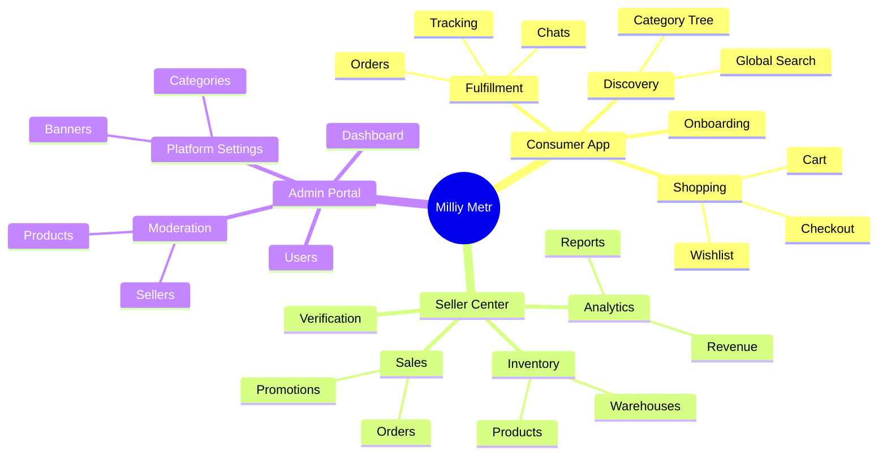

# MILLIY METR - Master Product Blueprint

> **Tagline:** Yuqori Sifat
> **Platform:** Enterprise Multi-Vendor Construction Materials Marketplace
> **Version:** 1.0.0 (Production Blueprint)

This document is the **Master Product Blueprint** for Milliy Metr. It is designed to align Product Managers, UI/UX Designers, Flutter Engineers, Backend Architects, and QA Teams before development begins.

---

## 1. Information Architecture (IA)

The application is structured into three primary domains, isolated securely via RBAC (Role-Based Access Control) at the routing layer.

---

## 2. Complete Module Map & Dependencies

Modules are loosely coupled. They interact through defined API contracts and state providers.

- **Core Module:** Network, Storage, Auth State, Theme. (Dependency of ALL modules).
- **Auth Module:** Login, OTP, Registration.
- **Catalog Module:** Products, Categories. (Depends on Core).
- **Cart Module:** (Depends on Catalog, Auth).
- **Order Module:** Checkout, Payment, Tracking. (Depends on Cart, User Profile).
- **Seller Module:** Dashboard, Inventory. (Depends on Catalog, Auth, Order).
- **Admin Module:** Global oversight. (Depends on everything).

---

## 3. Complete Screen Inventory

Every screen required for production.

### A. Authentication & Onboarding
- **Splash:** Brand entry. API: GET /config. State: Loading pulse.
- **Language Selection:** Uz, Ru, En.
- **Onboarding:** 3-step value prop. (Skip/Next).
- **Login:** Phone input. State: Loading spinner on button.
- **OTP Verification:** 6-digit pin code, countdown timer.
- **Register:** Name, Phone, Terms Checkbox.
- **Forgot Password (if email used):** Reset flow.

### B. Customer Module
- **Home:** Search App Bar, Hero Banners, Top Categories, Popular Construction Materials (Cement, Rebar), Recently Viewed.
- **Categories:** Master list of construction domains (Plumbing, Electrical, Masonry).
- **Sub-Categories:** Drilling down (e.g., Masonry -> Bricks -> Red Bricks).
- **Product Listing Page (PLP):** Grid view, Filters (Brand, Price, MOQ), Sort (Cheapest, Nearest). Empty State: "No materials found".
- **Product Details Page (PDP):** Image Carousel, Specs (Weight, Dimensions), Price (Retail/Wholesale), MOQ, Delivery Options, Seller Rating, "Add to Cart" sticky FAB.
- **Store Profile:** Seller's banner, Rating, Verification Badge, Store's Products.
- **Search (Advanced):** Voice/Barcode ready. Auto-suggest.
- **Wishlist:** Saved products for later projects.
- **Cart:** Item summary, Qty toggles (enforcing MOQ).
- **Checkout:** Delivery Address select, Payment Method select, Promo code input.
- **Payment:** Click/Payme WebView or deep link.
- **Order Success:** Confirmation ID, Next Steps.
- **Orders (History):** List of past and active orders.
- **Order Tracking:** Timeline (Pending -> Accepted -> Shipped -> Delivered).
- **Reviews & Ratings:** Text area, Star rating for Product and Delivery.
- **Chat:** Real-time messaging with seller (negotiation/clarification).
- **Profile & Settings:** Address book, Language, Theme (Light/Dark).
- **Support & FAQ:** Returns policy, Contact Admin.

### C. Seller Module (Mobile & Tablet)
- **Seller Registration:** Submit business details (Tax ID, License).
- **Seller Verification:** Document upload, Status tracking (Pending Admin Approval).
- **Dashboard:** Revenue Chart (Today, Month), Pending Orders counter.
- **My Products:** Inventory list, Quick toggle Active/Inactive.
- **Create Product (Construction Specific):** Title, Category, Brand, Unit (Ton, Kg, Piece), Wholesale Price, MOQ, Stock Qty, Dimensions.
- **Warehouse Management:** Setup pickup locations.
- **Seller Orders:** Manage incoming orders (Accept, Prepare, Dispatch).
- **Analytics:** Conversion rates, top-selling items (e.g., "500 Grade Cement").
- **Promotions:** Create coupons.
- **Chat:** Reply to customer queries.

### D. Admin Module (Web/Tablet)
- **Admin Login:** High-security access (2FA).
- **Global Dashboard:** GMV, Active Users, System Health.
- **Seller Verification:** Review uploaded docs, Approve/Reject.
- **Product Approval:** Review newly added items (prevent prohibited items).
- **Category/Brand CMS:** Add new construction brands or material types.
- **Banner Management:** Update homepage promos.
- **Order Oversight:** View all platform transactions.
- **Refunds & Complaints:** Dispute resolution center.
- **Role Management:** Assign Admin/Moderator permissions.

---

## 4. Complete User Flows (Journeys)

### A. Customer Purchase Flow
1. Open App -> Home.
2. Tap Search -> Type "Armatura 12mm".
3. PLP -> Tap filter -> Select "Wholesale", Sort "Price: Low to High".
4. PDP -> Check specs, verify MOQ is 1 Ton. Tap "Add to Cart".
5. Cart -> Tap "Checkout".
6. Checkout -> Add Delivery Site Address (Map pin). Select "Payme".
7. Payment -> Complete transaction via Payme.
8. Redirect -> Order Success.

### B. Seller Product Lifecycle Flow
1. Seller Dashboard -> "Add Product".
2. Select Category (Roofing -> Corrugated Sheets).
3. Fill Specs (Thickness: 0.4mm, Color: Red).
4. Set Price (50,000 UZS / sq.m), Set MOQ (50 sq.m).
5. Submit -> State becomes `PENDING_APPROVAL`.
6. Admin Dashboard -> Reviews specs -> Clicks `APPROVE`.
7. Product goes live on Customer App.

---

## 5. System Lifecycles

### Order Lifecycle
`PENDING_PAYMENT` -> `CONFIRMED` -> `PREPARING` (Seller accepted) -> `READY_FOR_PICKUP` / `SHIPPED` -> `DELIVERED` -> `COMPLETED`.

### Notification Lifecycle (Push & In-App)
- **Transactional:** Order Placed, Payment Failed, Order Shipped.
- **Operational (Seller):** New Order Received, Product Approved.
- **Marketing:** Flash Sale on Cement.
*Architecture:* FCM (Firebase Cloud Messaging) triggers local flutter_local_notifications.

---

## 6. Product Data System (Construction Specific)
Unlike clothes or phones, construction materials require strict attributes:
- **Units System:** `kg`, `ton`, `meter`, `sq_meter`, `cubic_meter`, `piece`, `pallet`.
- **Pricing Strategy:** 
  - *Retail Price:* For single pieces (e.g., 1 bag of cement).
  - *Wholesale Price:* Requires hitting the MOQ (Minimum Order Quantity).
- **Logistics Specs:** Weight per unit and Volume per unit (Critical for calculating truck delivery fees).

---

## 7. UX & UI Best Practices (Material Design 3)
- **One-Handed Use:** Bottom Navigation and Bottom Sheets for all major actions (Filters, Sorting, Cart actions).
- **Typography:** Inter or Roboto. Large clear numbers for prices and quantities. No confusing fonts.
- **Trust Indicators:** Verified Seller badges (Blue Checkmark) must be prominent. 
- **Offline Resilience:** If network drops, cache (Hive) loads previous product listings and shows a subtle "Offline" top banner.
- **Error States:** Friendly illustrations. Never raw exception text.
- **Responsive:** Fluid scaling for Tablet (Navigation Rail instead of Bottom Nav, multi-column grid for products).

---

## 8. Marketplace Rules & Future Expansion

### Core Rules
- **No Guest Checkout:** Construction deliveries require precise addresses and phone numbers. Must be logged in.
- **Approval Gates:** Stores and Products MUST be approved by an Admin before going public to maintain enterprise quality (Yuqori Sifat).

### Future Expansion Strategy (Phase 2+)
- **AI Search:** "I need materials for a 100 sq.m brick wall" -> AI returns Bricks, Cement, Sand quantities.
- **Logistics Integration:** Yandex Cargo / Local trucking API integration for automated delivery fee calculation based on total order weight.
- **B2B Credit:** Deferred payments or installment plans (Uzum Nasiya) for large contractors.
- **Warehouse Scanning:** Barcode scanning for sellers to quickly update stock levels.

---
*End of Master Product Blueprint for Milliy Metr.*
