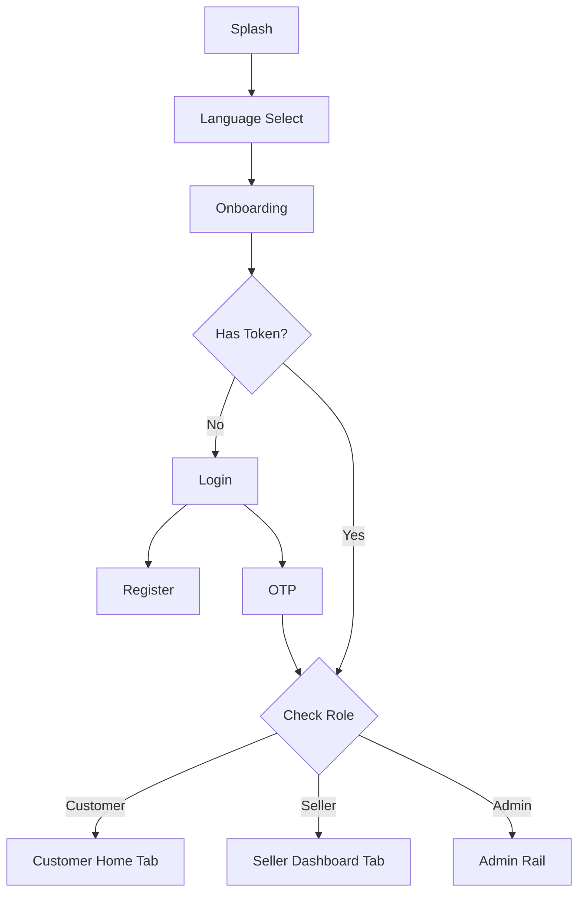
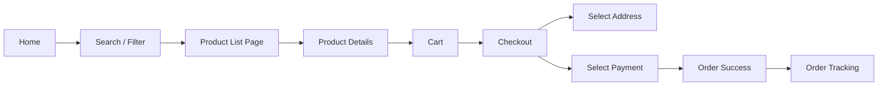
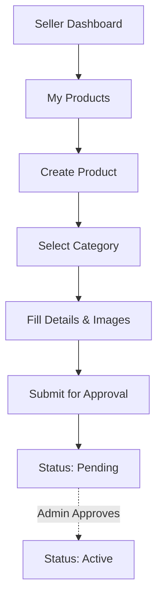

# MILLIY METR - UX Architecture & Screen Flow

> **Tagline:** Yuqori Sifat
> **Type:** Multi-Vendor Construction Materials Marketplace
> **Focus:** Premium User Experience, Conversion Optimization, Enterprise Workflows

This document defines the complete User Experience (UX) Architecture, Information Architecture (IA), and Screen Flows for all user roles in the Milliy Metr platform.

---

## 1. Information Architecture (IA)

The IA is structured to separate concerns between general consumers, sellers, and system administrators, ensuring each user type has a focused, noise-free experience.

- **Guest/Customer Scope:** Focus on discovery, search, comparison, and frictionless checkout.
- **Seller Scope:** Focus on inventory management, order fulfillment, and analytics.
- **Admin Scope:** Focus on moderation, system health, user management, and global analytics.

---

## 2. Complete Screen List & Dependencies

### Module A: Onboarding & Authentication
| Screen Name | Purpose | Incoming | Outgoing | Required API | States & Components |
| :--- | :--- | :--- | :--- | :--- | :--- |
| **Splash** | Brand init, load core data | App Launch | Language / Home | `GET /config` | Load: Logo pulse. Error: Retry button. |
| **Language Select** | Set app locale | Splash, Settings | Onboarding | Local only | Comp: Radio list, Primary Button. |
| **Onboarding** | Value proposition | Language | Login / Home | Local only | Comp: Carousel, Skip, Next buttons. |
| **Login** | Authenticate user | Onboarding, Auth Guard | OTP / Register | `POST /auth/login` | Comp: Phone Input, Primary Button. Load: Button spinner. |
| **OTP Verify** | Validate phone | Login, Register | Home | `POST /auth/verify` | Comp: PinCodeField, Resend timer. |
| **Register** | Create account | Login | OTP | `POST /auth/register`| Comp: Name/Phone fields, Checkbox. |

### Module B: Customer Flow (Mobile)
| Screen Name | Purpose | Actions | API Requirements | States & Components |
| :--- | :--- | :--- | :--- | :--- |
| **Home** | Discovery | Search, Tap banner, Tap category | `GET /home-feed` | Empty: N/A. Load: Skeleton Banners/Cards. Comp: SearchBar, Carousel, Category Chips, Product Cards. |
| **Categories** | Browse taxonomy | Select category | `GET /categories` | Load: Skeleton List. Comp: ExpansionTiles, Grid. |
| **Subcategories** | Refine browse | Select child | `GET /categories/{id}` | Comp: ListTiles, Icons. |
| **Product List** | View filtered items | Sort, Filter, Tap item | `GET /products` | Empty: "No products found". Comp: Sort BottomSheet, Filter Drawer, Grid/List view toggle. |
| **Product Details** | Conversion | Add to Cart, Favorite, Chat | `GET /products/{id}` | Load: Skeleton details. Comp: Image Gallery, Price Widget, Variant Selector, Sticky Cart FAB. |
| **Store Profile** | View seller | Search store, Tap product | `GET /stores/{id}` | Comp: Store Banner, Verified Badge, Rating, Product Grid. |
| **Wishlist** | Saved items | Move to cart, Remove | `GET /wishlist` | Empty: "No favorites". Comp: Product List, Swipe to delete. |
| **Cart** | Pre-checkout | Edit qty, Remove, Checkout | `GET /cart` | Empty: "Cart is empty". Comp: Qty Selector, Total Bottom Bar. |
| **Checkout** | Finalize order | Select Address/Payment | `POST /orders` | Comp: Address Card, Payment Radio, Promo Input. |
| **Order Success** | Confirmation | View Order, Home | None | Comp: Lottie Checkmark, Order ID, Primary Button. |
| **Orders** | History | Track, Reorder | `GET /orders` | Empty: "No orders yet". Comp: Order Cards, Status Badges. |
| **Order Details** | Deep dive | Track delivery, Review | `GET /orders/{id}` | Comp: Timeline, Item List, Chat Button. |
| **Chat** | Communication | Send msg, Send photo | `WS /chat` | Offline: "Connecting...". Comp: Message Bubbles, Input Field. |
| **Profile** | User management | Edit info, Logout | `GET /users/me` | Comp: Avatar, ListTiles, Logout Button. |

### Module C: Seller Flow (Mobile / Tablet)
| Screen Name | Purpose | Actions | API Requirements | States & Components |
| :--- | :--- | :--- | :--- | :--- |
| **Seller Dashboard** | Overview | View stats, Pending orders | `GET /seller/stats` | Load: Chart Skeletons. Comp: KPI Cards, Charts. |
| **My Products** | Inventory mgmt | Add, Edit, Delete | `GET /seller/products` | Comp: Product List, Stock Badges, Status (Pending/Active). |
| **Create/Edit Product**| Data entry | Upload image, Set price/qty | `POST /seller/products` | Comp: Image Picker, Categorized Inputs, Rich Text. |
| **Seller Orders** | Fulfillment | Accept, Ship, Cancel | `GET /seller/orders` | Comp: TabBar (Pending, Shipped), Action Buttons. |

### Module D: Admin Flow (Tablet / Desktop Web)
| Screen Name | Purpose | Actions | API Requirements | States & Components |
| :--- | :--- | :--- | :--- | :--- |
| **Admin Login** | Secure access | Enter credentials | `POST /admin/login` | Comp: Card Form. |
| **Dashboard** | Global stats | View GMV, Active Users | `GET /admin/stats` | Comp: DataGrid, KPI Cards, Charts. |
| **Product Approval** | Moderation | Approve, Reject, Ban | `GET /admin/products` | Comp: Data Table, Action Menu, Detail Dialog. |
| **Seller Mgmt** | Verify stores | View docs, Approve | `GET /admin/stores` | Comp: Data Table, Document Viewer Modal. |

---

## 3. User Flow Diagrams (Mermaid)

### Authentication & Routing Flow

### Customer Purchasing Flow

### Seller Product Creation Flow

---

## 4. Feature Flow & Dependencies

- **Checkout depends on:** Authentication (Guest checkout not allowed for construction materials due to delivery logistics), Address Management, Payment Gateway.
- **Product Details depends on:** Catalog Service, Reviews Service, Store Service (to show seller info).
- **Chat depends on:** WebSocket Service, Order Service (Chats are linked to orders or products).

---

## 5. Navigation Architecture

**Customer Mobile (Bottom Navigation):**
1. Home (Feed)
2. Catalog (Categories)
3. Cart (Badge counter)
4. Profile (Orders, Wishlist, Settings)

**Seller Mobile/Tablet (Bottom Navigation):**
1. Dashboard (KPIs)
2. Products (Inventory)
3. Orders (Fulfillment)
4. Store (Settings, Profile)

**Admin Web/Tablet (Navigation Rail - Left):**
1. Dashboard
2. Approvals (Badge counter)
3. Users
4. Sellers
5. Categories
6. Reports
7. Settings

---

## 6. UX Best Practices

### Mobile UX Guidelines (Customer & Seller)
- **Thumb Zone Design:** Place primary CTAs (Add to Cart, Checkout, Save) at the bottom of the screen. Sticky bottom bars are mandatory for PDPs and Cart.
- **Frictionless Input:** Use numeric keyboards for OTP, phone numbers, and product quantities. Auto-focus fields where appropriate.
- **Progressive Disclosure:** Hide complex filters inside bottom sheets. Keep the Product List Page clean.
- **Feedback Loops:** Always use SnackBar for successful actions (e.g., "Added to Cart"). Use subtle haptic feedback for primary actions.

### Tablet UX Guidelines
- **Split Views:** Use master-detail layouts (e.g., Order List on the left 30%, Order Details on the right 70%).
- **Navigation:** Replace Bottom Navigation with Navigation Rail to maximize vertical scrolling space for product grids.
- **Grids:** Expand product grids from 2 columns (phone) to 4-5 columns (tablet portrait) or 6 columns (tablet landscape).

### Admin UX Guidelines (Web/Desktop)
- **Data Density:** Admins need high data density. Use compact data tables with sticky headers.
- **Bulk Actions:** Allow selecting multiple rows (products, users) to apply bulk approvals or bans.
- **Keyboard Shortcuts:** Support `Esc` to close modals, `Enter` to submit forms, `/` to focus search.
- **Auditability:** Always show "Last updated by [User] at [Time]" on critical records.

---

## 7. State Management Guidelines (UI Level)

- **Loading State:** Avoid blocking overlays unless processing a payment. Use Shimmer (Skeleton) loading for initial data fetches, and inline spinners inside buttons for form submissions.
- **Empty State:** Never show a blank screen. Always include an illustration, a clear message ("No products found"), and a CTA ("Clear Filters").
- **Error State:** Differentiate between "Network Error" (Retry button) and "Not Found" (Go Back button).
- **Offline State:** If Hive cache exists, show cached data with a subtle "Offline Mode" banner at the top. If no cache, show offline illustration.

---
*End of UX Architecture Document for Milliy Metr.*
